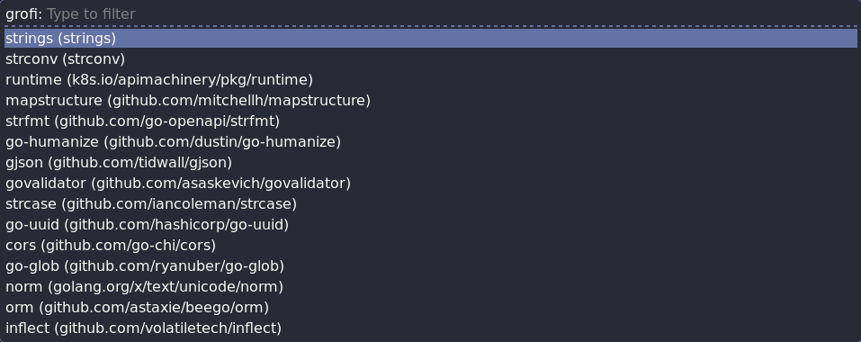

## grofi

Small rofi script to search for Go packages on `pkg.go.dev`.

Buind and install it in your PATH:
```
go build .
chmod u+x grofi
mv grofi /usr/local/bin
```

> n.b.: replace '/usr/local/bin' with any path sourced when a new terminal window opens up.

Then add a custom keyboard shortcut to launch `rofi` in script mode according to your desktop environment (e.g. see [here](https://docs.fedoraproject.org/en-US/quick-docs/proc_setting-key-shortcut/) for GNOME) executing the following command:
```
rofi -show grofi -modi "grofi:/usr/local/bin/grofi" 
```

Launch `rofi` with the configured shortcut. Then, type the name of a package or a keyword and press <kbd>Enter</kbd> to open in the browser the documentation of the selected entry:



---

### References:
- [rofi-script(5)](https://man.archlinux.org/man/rofi-script.5.en)
- [Rofi based scripts](https://github.com/davatorium/rofi-scripts)
